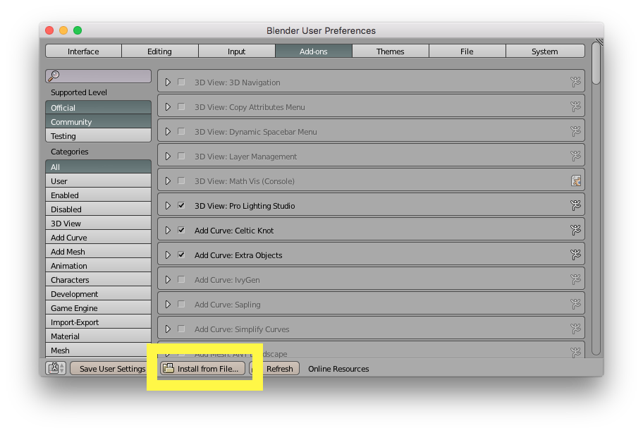
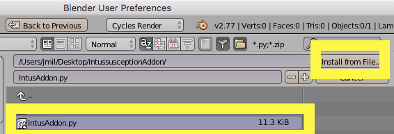
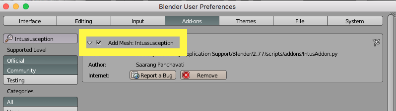
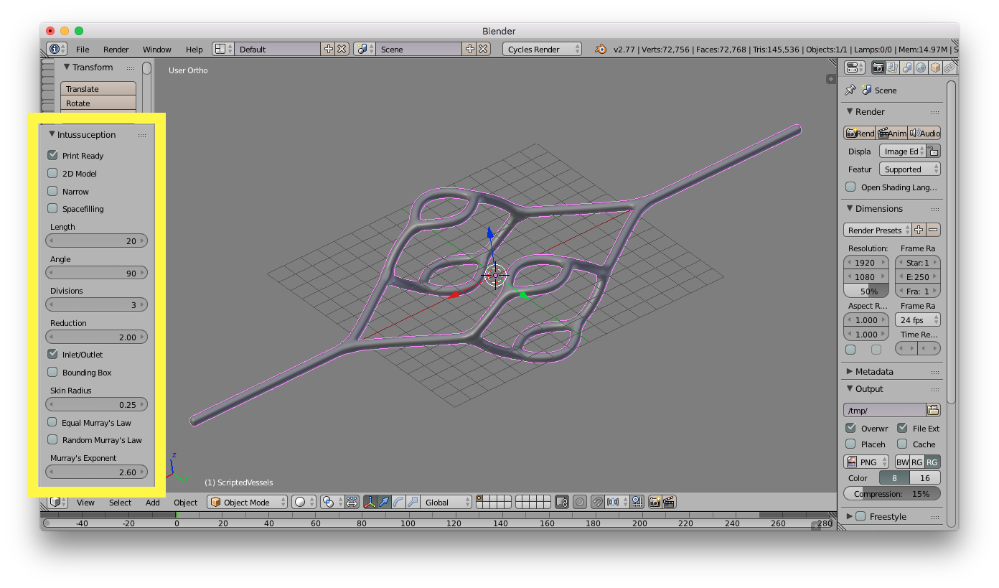
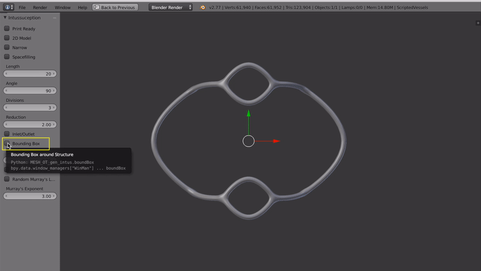

# Intussusception Add-on for Blender

Authored by Saarang Panchavati, Miller Lab, Rice University, July 2016 | Advisor: Jordan Miller

A [Blender](http://www.blender.org) add-on for generating Intussusception fractal vasculature for 3D printing and computational fluid dynamics simulations and modeling.

## Overview

Intussusception is the natural process by which one blood vessel splits into two.  This add-on is an attempt to model this process in order to create functional positive flow models for 3D vascular networks. We create fractal vasculature by starting with a single tube and sequentially, dichotomously dividing all available tubes with each fractal generation. 

Currently, this add-on allows the user to adjust the following parameters: 

Print-ready scaling, length, angle, number of divisions, reduction in branching distance, inlet/outlet, bounding box, narrowing, space filling, skin radius, and Murray’s Law implementation. 

## Documentation 

This git repository includes: The python file for the add-on, and explanatory videos. 

## Installation/Usage Instructions

1. First ensure you have downloaded and and installed the latest version of [Blender](https://www.blender.org/download/). This add-on has been developed and tested with `Blender 2.77a`.

1. Download this repository: [https://github.com/MillerLabFTW/IntussusceptionAddon/archive/master.zip](https://github.com/MillerLabFTW/IntussusceptionAddon/archive/master.zip)

1. Unzip the repository. You should find the required `IntusAddon.py` inside.

1. In Blender, navigate to `User Preferences > Add-ons > Install from File ` and find and select the `IntusAddon.py` file in this repository and activate it. Screenshots:

1. Ensure it is checked in the add-on menu - It will be called `Add Mesh: Intussusception`

1. To use the add-on, in the 3D view window, type `<spacebar>` in the Blender Window and search for `Intussusception` in the pop-up.

1. You can adjust all the controls described above under `Overview`. To see what they will do, watch the video [`Intus-Addon-Display`](https://github.com/MillerLabFTW/IntussusceptionAddon/blob/master/PicsVids/Intus-Addon-Display.mov?raw=true) located in the `PicsVids` folder of this repository.

### Overview of Parameters
`Divisions` - Number of times the model divides

`Length` - Adjusts length of the model

`Angle` - Adjusts angle of initial branching

`Reduction` - Adjusts amount by which the distance between branches decreases each division

`Inlet/Outlet` - Adds inlet and outlet to model

`Bounding Box` - Adds bounding box to model 

`Print Ready` - Adjusts model and bounding box scaling to 34x14x11 dimensions

`2D Model` - Collapses Intussusception to 2 Dimensions

`Narrow` - Moves back initial vertices to compact model, allowing minimal volume to be consumed by vasculature. 

`Spacefilling` - Moves groups of branches to be more space filling. Only works when `Narrow` is on.

`Skin Radius` - Adjusts the radius of the skin modifier on all vertices

### Murray’s Law

[Murray’s Law](https://en.wikipedia.org/wiki/Murray%27s_law) describes the relationship between a parent branch and its daughter branches wherein:
r3p = rd13+ rd23 + … + rdn3

`Murray’s Exponent` - Varies the exponent for Murray’s Law, which is generally 3

`Equal Murray’s Law` - Applies Murray’s Law on the model, assuming that all daughter branches have the same radius

`Random Murray’s Law` - Applies Murray’s Law on the model, but allows daughter branches to be of varying diameter 

## Acknowledgements

