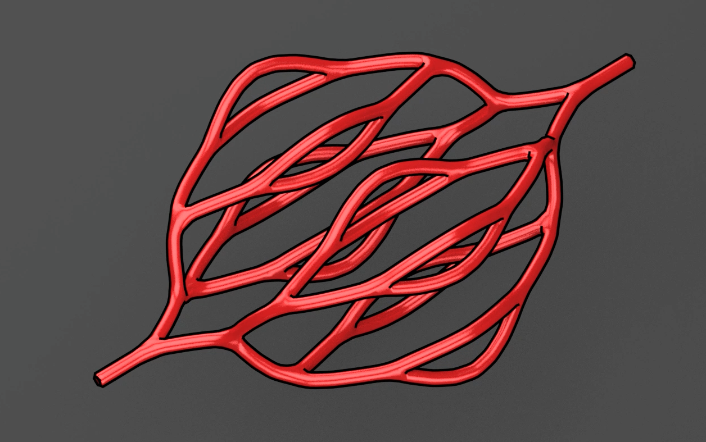

# Intussusception Addon for Blender

Authored by Saarang Panchavati, Miller Lab, Rice University, July 2016 | Advisor: Jordan Miller

A [Blender](http://www.blender.org) add-on for generating Intussusception fractal vasculature for 3D printing and computational fluid dynamics simulations and modeling.

###Overview

Intussusception is the natural process by which one blood vessel splits into two.  This add-on is an attempt to model this process in order to create functional positive flow models for 3D vascular networks. We create fractal vasculature by starting with a single tube and sequentially, dichotomously dividing all available tubes with each fractal generation. 

Currently, this add-on allows the user to adjust the following parameters: 

Print-ready scaling, length, angle, number of divisions, reduction in branching distance, inlet/outlet, bounding box, skin radius, and Murray’s Law implementation. 

###Documentation 

This git repository includes: The python file for the add-on, and explanatory videos. 

###Installation/Usage Instructions

1. First ensure you have downloaded and and installed the latest version of [Blender](http://www.blender.org). This add-on has been developed and tested with `Blender 2.77a`.

1. Download this repository: [https://github.com/MillerLabFTW/IntussusceptionAddon/archive/master.zip](https://github.com/MillerLabFTW/IntussusceptionAddon/archive/master.zip)

1. Unzip the repository. You should find the required `IntusAddon.py` inside.

1. In Blender, navigate to `User Preferences > Add-ons > Install from File ` and find and select the `IntusAddon.py` file in this repository

1. Ensure it is checked in the add-on menu - It will be called `Add Mesh: Intussusception`

1. To use type spacebar in the Blender Window and search for `Intussusception`

1. You can adjust all the controls described above under `Overview`. To see what they will do, watch the video `Intus-Addon-Display` located in the `PicsVids` folder of this repository.

###Acknowledgements

